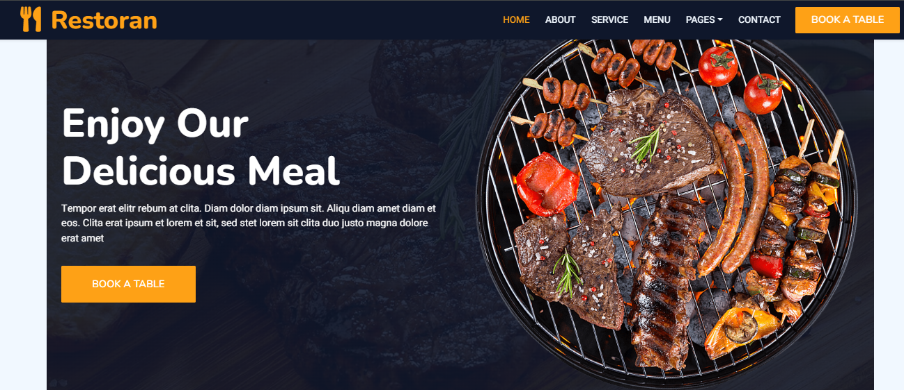

<!-- PROJECT LOGO -->

<a id="readme-top"></a>

<div align="center">
  <h1 align="center">Restaurant Website</h1>
  <h3 align="center">Vite + React + Typescript</h3>
  <p align="center"> An awesome copy-to-learn project »
    <a href='https://themewagon.github.io/restoran/'>Restoran </a>
  </p>
  <a href="https://github.com/codeGero24/restauran">
    
  </a>
  <br />
  <a align="center" href="https://github.com/codeGero24/restaurant">
    <strong>Explore the Copy project in React »</strong>
  </a>
  <br /><br />
  <a href="https://github.com/codeGero24/restaurant">View Demo</a>
</div>

<br />

<!-- TABLE OF CONTENTS -->
<details>
  <summary>Table of Contents</summary>
  <ol>
    <li>
      <a href="#about-the-project">About The Project</a>
      <ul>
        <li><a href="#built-with">Built With</a></li>
      </ul>
    </li>
    <li>
      <a href="#getting-started">Getting Started</a>
      <ul>
        <li><a href="#prerequisites">Prerequisites</a></li>
        <li><a href="#installation">Installation</a></li>
        <li><a href="#contributors">Contributors</a></li>
      </ul>
    </li>
    <li><a href="#license">License</a></li>
    <li><a href="#contact">Contact</a></li>
  </ol>
</details>

<!-- ABOUT THE PROJECT -->

## About The Project

I created this project to test my skills as a Fe developer.
The project was created with Vite + React + Typescript in addition to the help of other libraries listed below.

### Built With

<div style="display:grid; grid-template-columns: 1fr 1fr;background-color:#1E1E1E; padding: 20px; border-radius: 10px; gap: 20px;">
  <a href="https://vitejs.dev" style="text-decoration: none; color: white;">
     <strong>VITE</strong>
  </a>
    <a href="https://react.dev" style=" text-decoration: none; color: white;">
    <strong>REACT</strong>
  </a>
  <a href="https://www.typescriptlang.org" style=" text-decoration: none; color: white;">
     <strong>TYPESCRIPT</strong>
  </a>
  <a href="https://sass-lang.com" style=" text-decoration: none; color: white;">
     <strong>SASS</strong>
  </a>
  <a href="https://tailwindcss.com" style=" text-decoration: none; color: white;">
     <strong>TAILWIND CSS</strong>
  </a>
  <a href="https://lucide.dev" style=" text-decoration: none; color: white;">
     <strong>LUCIDE</strong>
  </a>
  <a href="https://zustand.pmnd.rs" style=" text-decoration: none; color: white;">
     <strong>ZUSTAND</strong>
  </a>
  <a href="https://tanstack.com/query" style=" text-decoration: none; color: white;">
     <strong>TANSTACK QUERY</strong>
  </a>
  <a href="https://axios-http.com" style=" text-decoration: none; color: white;">
    
  </a>
  <a href="https://www.embla-carousel.com" style=" text-decoration: none; color: white;">
     <strong>EMBLA CAROUSEL REACT</strong>
  </a>
</div>
<p align="right">(<a href="#readme-top">back to top</a>)</p>

<!-- GETTING STARTED -->

## Getting Started

This is an example of how you may give instructions on setting up your project locally.
To get a local copy up and running follow these simple example steps.

<!-- PRE REQUISITES -->

### Prerequisites

This is an example of how to list things you need to use the software and how to install them.

- npm
  ```sh
  npm install npm@latest -g
  ```

<!-- INSTALLATION -->

### Installation

_Below is an example of how you can instruct your audience on installing and setting up your app. This template doesn't rely on any external dependencies or services._

1. Clone the repo
   ```sh
   git clone https://github.com/codeGero24/restaurant
   ```
2. Install NPM packages
   ```sh
   npm install
   ```
3. Start env dev
   ```sh
   npm run dev
   ```

<p align="right">(<a href="#readme-top">back to top</a>)</p>

<!-- CONTRIBUTORS -->

### contributors:

<a href="https://github.com/codeGero24/restaurant/graphs/contributors">
  
</a>

<p align="right">(<a href="#readme-top">back to top</a>)</p>

<!-- LICENSE -->

## License

Apache License Version 2.0

<p align="right">(<a href="#readme-top">back to top</a>)</p>

<!-- CONTACT -->

## Contact

Calogero Michael Messina - [@linkedin](https://www.linkedin.com/in/calogero-michael-messina-b3832013b/) - c.messina97engineer@gmail.com

Project Link: [https://github.com/codeGero24/restaurant](https://github.com/codeGero24/restaurant)

<p align="right">(<a href="#readme-top">back to top</a>)</p>
